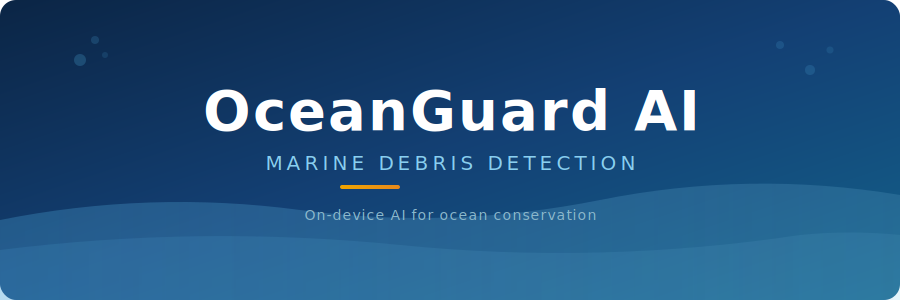
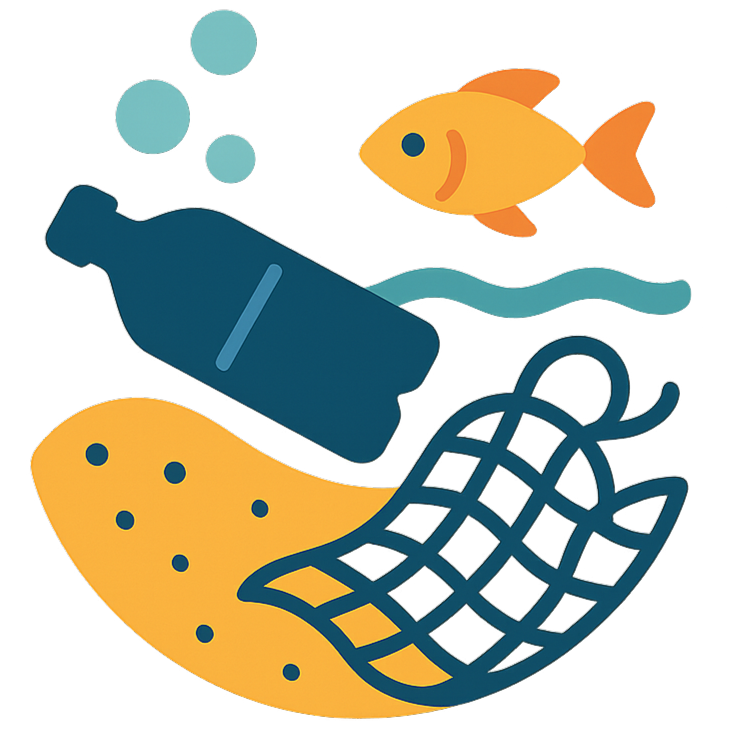

<p align="center">
  
</p>

<p align="center">
  
</p>

<h1 align="center">OceanGuard AI</h1>

<p align="center">
  <strong>On-device marine debris intelligence — powered by Gemma 4</strong><br/>
  <sub>100% offline &bull; Private &bull; Agentic reporting &bull; 6 languages</sub>
</p>

<p align="center">
  <a href="https://github.com/asferrer/OceanguardAI/releases/latest">
    
  </a>
  &nbsp;
  
  &nbsp;
  
  &nbsp;
  
  &nbsp;
  
</p>

<p align="center">
  <a href="https://github.com/asferrer/OceanguardAI/releases/latest/download/OceanGuard-AI-latest.apk">
    
  </a>
  &nbsp;&nbsp;
  <a href="https://asferrer.github.io/OceanguardAI">
    
  </a>
  &nbsp;&nbsp;
  <a href="https://huggingface.co/asferrer/gemma-4-E2B-it-oceanguard-marine-debris">
    
  </a>
</p>

---

## About

OceanGuard AI is an Android application that detects and classifies marine debris from photos and videos using **Gemma 4** running entirely on the device. No internet connection is required after the initial model download, no images leave the phone, and every number in every generated report is sourced from a typed Kotlin function — not invented by the model.

The project is part of a doctoral research line on edge AI for marine debris detection at the **Universidad de Alicante**, with multiple peer-reviewed publications backing the methodology.

## Why Gemma 4

A single open-weights model — **Gemma 4 E2B** via LiteRT-LM — drives both perception and reporting on the phone:

- **Open-vocabulary detection.** Gemma 4 Vision emits `box_2d` bounding boxes with free-text labels and material guesses, expanding the deterministic 8-class debris taxonomy into 50 fine-grained sub-types mapped onto 11 ecological-impact families.
- **Grounded report generation.** Gemma 4 Text uses native function calling to query Kotlin tools (debris counts, percentages, GPS waypoints, ecological impacts) and writes scientific-grade reports in six languages and three audience voices, with zero fabricated statistics.
- **One on-device weight.** A single shared engine instance powers both modes — no cloud round-trip, no per-image cost, no telemetry.

## Features

<table>
<tr>
<td width="50%">

### Detection
- **Single-shot deep analysis** — full Gemma 4 Vision pass on captured photos
- **Image, gallery, and batch input** — analyse photos one by one or in batches
- **Open-vocabulary** — 50 fine-grained debris sub-types collapsed to 11 canonical families
- **Bounding-box visualisation** — corner brackets, glow, animated overlay

</td>
<td width="50%">

### Agentic Reporting
- **Native tool calling** — Gemma 4 invokes 8 typed Kotlin functions for every fact in the report
- **Live token stream** — see each tool call announced and the report tokens flow in real time
- **Three audiences** — Scientific, NGO Manager, Citizen voice
- **Six languages** — EN, ES, FR, DE, IT, PT
- **Markdown + PDF export** with annotated image galleries

</td>
</tr>
<tr>
<td width="50%">

### Mapping & Tracking
- **GPS geotagging** — EXIF first, device GPS fallback
- **Offline maps** — MapLibre + OpenFreeMap, no API key
- **Zone aggregation** — automatic hotspot clustering on the map
- **Ecosystem health score** — aggregated per zone

</td>
<td width="50%">

### Privacy & Gamification
- **100% offline** — no cloud, no telemetry, no accounts
- **All data on-device** — deletable at any time from settings
- **MarineDex** — pixel-art collection with achievements
- **Underwater UI** — high contrast for dive-mask visibility

</td>
</tr>
</table>

## Single-Conversation Agentic Tool Calling

Open VLMs on a phone routinely hallucinate the very statistics environmental policy depends on — degradation times, percentage breakdowns, risk scores, GPS waypoints. A government cannot defensibly act on a fabricated 23 %.

OceanGuard AI flips the contract using Gemma 4 native function calling. Instead of asking the model to copy pre-aggregated numbers from a prompt, it lets Gemma 4 **query** a typed Kotlin interface for each fact it needs, all inside one LiteRT-LM conversation:

```
USER → "Generate report"
  │
  ▼
[ One Gemma 4 Conversation — KV cache persists across every turn ]
  │
  ├── Step 1 · Tool dispatch (warm KV)
  │     · ToolAgentLoop · MAX_TOOL_ROUNDS = 14
  │     · 8 typed Kotlin @Tool methods: debris-summary, material-breakdown,
  │       type-breakdown, risk-assessment, collection-waypoints,
  │       survey-statistics, ecological-impacts, temporal-trend
  │     · onToolCallStarted → UI banner "Querying <tool>…"
  │
  ▼  (same conversation, no reset)
  ├── Step 2 · Report writing (warm KV)
  │     · Tool responses already in cache
  │     · Tokens stream live to the UI via onPartialResult
  │
  ▼
[ Post-process · repairHallucinations(canon) ]
  · Canonical row map is built offline, never sent to the model
  · Any row whose label matches a canonical entry is rewritten verbatim
  ▼
[ ReportValidator · 12+ checks → validationScore 0–100 ]
  ▼
Grounded Report → Markdown · PDF · CSV · GeoJSON
```

Every percentage is computed once in Kotlin, every risk score is read from a Kotlin map, and the model has no opportunity to mis-tokenise a number it never authored.

## Domain-Adapted LoRA Adapter

A Stage-1/Stage-2 LoRA adapter trained on **10,247 COCO images** of marine debris with the Unsloth FastVisionModel stack is published as a reproducible artefact:

- **Adapter:** [`asferrer/gemma-4-E2B-it-oceanguard-marine-debris`](https://huggingface.co/asferrer/gemma-4-E2B-it-oceanguard-marine-debris) on Hugging Face
- **Notebook:** `docs/submission/notebook_finetune.ipynb` — runs end-to-end on Kaggle (data prep, both training stages, adapter merge, sanity-check inference)
- **Reported delta:** mAP@0.5 +0.056 vs the base Gemma 4 E2B on a 1000-image held-out test split

The adapter weights are shipped as `.safetensors` and ready to be merged back into the base for on-device deployment as soon as the `.litertlm` conversion pipeline stabilises upstream.

## On-Device Stack

| Component | Technology |
|-----------|-----------|
| **Vision & report model** | Gemma 4 E2B via LiteRT-LM 0.11 — single shared engine, ~2.6 GB on disk |
| **Tool runtime** | Native function calling on Gemma 4 · 8 typed Kotlin `@Tool` methods · `automaticToolCalling = false` agent loop |
| **UI** | Jetpack Compose + Material 3 · Kotlin 2.2 · min SDK 26 (Android 8.0) |
| **Camera** | CameraX 1.5 — hardware-rotation-aware capture |
| **Database** | Room 2.7 + DataStore preferences |
| **Maps** | MapLibre Compose + OpenFreeMap — no API key, offline tiles |

## Installation

> **Requirements:** Android 8.0+, ~200 MB storage for the APK and ~2.6 GB additional for the Gemma 4 model.

### Quick Install

1. **[Download the latest APK](https://github.com/asferrer/OceanguardAI/releases/latest/download/OceanGuard-AI-latest.apk)** directly to your device.
2. On your Android device: **Settings > Apps > ⋯ > Special access > Install unknown apps**.
3. Enable installation for your browser (Chrome, Firefox, etc.).
4. Open the downloaded APK and tap **Install**.

> [!NOTE]
> Google Play Protect may show a warning — this is normal for apps distributed outside the Play Store. Tap **"Install anyway"** to proceed. The APK is signed with a developer certificate.

### Gemma 4 Model Download

The first time you open the app and request a deep analysis or a report, you will be prompted to download the **Gemma 4 E2B** weights (~2.6 GB) from the LiteRT community mirror on Hugging Face. After that, the app is fully offline — flight mode is fine.

## Privacy

All processing happens **entirely on your device**. No data is collected, transmitted, or shared with any server. Camera images, GPS coordinates, and report contents are stored locally and can be deleted at any time from within the app.

| Data | Storage | Shared? |
|------|---------|---------|
| Photos & videos | Device only | Never |
| GPS coordinates | Device only | Never |
| Detection & report results | Device only | Never |
| Gemma 4 model weights | Device only | Downloaded once from Hugging Face, then never re-fetched |

Optional research contribution: the user can opt in to upload anonymised detection sessions to a self-hosted NAS (WiFi-only) to help improve future detector versions. This is **off by default** and fully transparent in the UI.

## Research & Publications

OceanGuard AI is built on peer-reviewed research and ongoing doctoral work.

### Papers

- **An experimental study on marine debris location and recognition using object detection**
  A. Sánchez-Ferrer, J.J. Valero-Mas, A.J. Gallego, J. Calvo-Zaragoza — *Pattern Recognition Letters*, 2023
  [ScienceDirect](https://www.sciencedirect.com/science/article/pii/S0167865522003889)

- **The CleanSea Set: A Benchmark Corpus for Underwater Debris Detection and Recognition**
  A. Sánchez-Ferrer, A.J. Gallego, J.J. Valero-Mas, J. Calvo-Zaragoza — *IbPRIA 2022*, LNCS Springer
  [Springer](https://link.springer.com/chapter/10.1007/978-3-031-04881-4_49)

### Hackathon

- **OceanGuard AI: Single-Conversation Agentic Tool Calling on Gemma 4 for Offline Marine Debris Reporting**
  Google Gemma 4 Good Hackathon — Kaggle, 2026
  Submission writeup: `docs/submission/WRITEUP_FINAL.md`

### Theses

- **Modelos de difusión aplicados a la detección de objetos en el fondo marino**
  A. Sánchez-Ferrer — Master's Thesis, Universidad de Alicante, 2024
  [RUA](https://rua.ua.es/entities/publication/88244474-6165-4cd9-a4af-68eff29d65c6)

- **Deep Learning aplicado a la detección de residuos en el fondo marino**
  A. Sánchez-Ferrer — Bachelor's Thesis, Universidad de Alicante, 2021
  [RUA](https://rua.ua.es/entities/publication/92c34588-9842-4ec3-8b15-97a8ce718e04)

## License

The application binary (APK) is provided for research and evaluation purposes. The Gemma 4 weights are governed by the [Gemma Terms of Use](https://ai.google.dev/gemma/terms). The OceanGuard LoRA adapter is released under Apache 2.0 for the training code and the same Gemma Terms for the merged weights.

---

<p align="center">
  <sub>Doctoral research on edge AI for marine debris detection — <a href="https://www.ua.es">Universidad de Alicante</a></sub>
</p>
